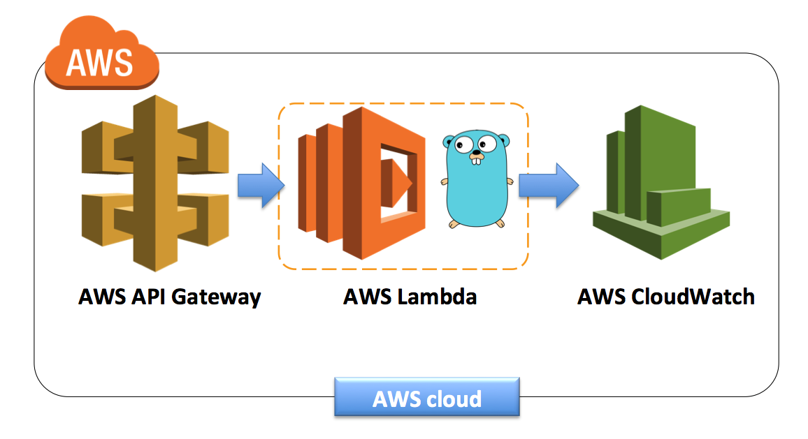

# gin-lambda



running golang using gin framework in AWS Lambda &amp; API Gateway

## Sample code

see the [main.go](./main.go) in master branch.

```go
package main

import (
	"log"
	"net/http"
	"os"

	"github.com/apex/gateway"
	"github.com/gin-gonic/gin"
)

func helloHandler(c *gin.Context) {
	name := c.Param("name")
	c.String(http.StatusOK, "Hello %s", name)
}

func welcomeHandler(c *gin.Context) {
	c.String(http.StatusOK, "Hello World from Go")
}

func rootHandler(c *gin.Context) {
	c.JSON(http.StatusOK, gin.H{
		"text": "Welcome to gin lambda server.",
	})
}

func routerEngine() *gin.Engine {
	// set server mode
	gin.SetMode(gin.DebugMode)

	r := gin.New()

	// Global middleware
	r.Use(gin.Logger())
	r.Use(gin.Recovery())

	r.GET("/welcome", welcomeHandler)
	r.GET("/user/:name", helloHandler)
	r.GET("/", rootHandler)

	return r
}

func main() {
	addr := ":" + os.Getenv("PORT")
	log.Fatal(gateway.ListenAndServe(addr, routerEngine()))
}
```

## Build and Upload

Build binary

```sh
$ GOOS=linux go build -o main .
$ zip deployment.zip main
```

Upload the `deployment.zip` to AWS Lambda using [drone-lambda](https://github.com/appleboy/drone-lambda) command.

```
$ AWS_ACCESS_KEY_ID=xxxx \ 
  AWS_SECRET_ACCESS_KEY=xxx \
  drone-lambda --region ap-southeast-1 \
  --function-name function_name \
  --zip-file deployment.zip
```

Output log:

```json
{
  CodeSha256: "r/I7yg9tX9MWPsPH337Xk5MIF1dVgkDCFhOrmAYe7hc=",
  CodeSize: 4334079,
  Description: "",
  Environment: {
    Variables: {
      PORT: "8080"
    }
  },
  FunctionArn: "arn:aws:lambda:ap-southeast-1:xxxxxxx:function:gin:7",
  FunctionName: "gin",
  Handler: "main",
  LastModified: "2018-01-21T06:21:28.395+0000",
  MemorySize: 128,
  Role: "arn:aws:iam::xxxxxxx:role/service-role/test",
  Runtime: "go1.x",
  Timeout: 3,
  TracingConfig: {
    Mode: "PassThrough"
  },
  Version: "7",
  VpcConfig: {
    SecurityGroupIds: [],
    SubnetIds: []
  }
}
```

## AWS Policy

Add the following AWS policy if you want to integrate with CI/CD tools like Jenkins, GitLab Ci or Drone.

```json
{
  "Version": "2012-10-17",
  "Statement": [
    {
      "Effect": "Allow",
      "Action": [
        "s3:PutObject",
        "iam:ListRoles",
        "lambda:UpdateFunctionCode",
        "lambda:CreateFunction"
      ],
      "Resource": "arn:aws:logs:*:*:*"
    }
  ]
}
```

## Benchmark

Memory: 128 MB, Latencies: `6.091282008s`

```
$ vegeta attack -rate=1024 -duration=10s -targets=target2.txt | tee results.bin | vegeta report
Requests      [total, rate]            10240, 1024.10
Duration      [total, attack, wait]    20.335101947s, 9.999018014s, 10.336083933s
Latencies     [mean, 50, 95, 99, max]  6.091282008s, 4.893951645s, 14.508009942s, 17.11847442s, 20.128384389s
Bytes In      [total, mean]            143360, 14.00
Bytes Out     [total, mean]            0, 0.00
Success       [ratio]                  100.00%
Status Codes  [code:count]             200:10240
```

Memory: 512 MB, Latencies: `1.491340336s`

```
$ vegeta attack -rate=1024 -duration=10s -targets=target2.txt | tee results.bin | vegeta report
Requests      [total, rate]            10240, 1024.10
Duration      [total, attack, wait]    11.989730554s, 9.999012371s, 1.990718183s
Latencies     [mean, 50, 95, 99, max]  1.491340336s, 1.114643849s, 4.112241113s, 6.087949237s, 10.107294516s
Bytes In      [total, mean]            143360, 14.00
Bytes Out     [total, mean]            0, 0.00
Success       [ratio]                  100.00%
Status Codes  [code:count]             200:10240
```
